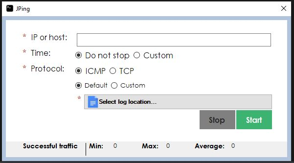

# JPing

##### Description: 
> JPing is a tool created to send ICMP and TCP pings pointing to an specific IP or host for short or long periods of time. What makes JPing very useful is the easy way you can customize the packets you are sending. Simply by selecting some of the available options that you have you are able to specify the protocol, amount of packets to send, the time JPing is going to be running, port, packet size, amount others.

##### Future features: 
> Add label saying number of fail or successful attempts 
> Include functionality to send UDP traffic
> Funcionality to capture all the packet information and generate a pcap file, not only the exception message as it is currently working 
> Funcionality to allow the user to capture only the failure pings or all the traffic in general and generate a pcap file
> Functionality to select the kind of ping failure that its going to be captured using checkboxes. 
